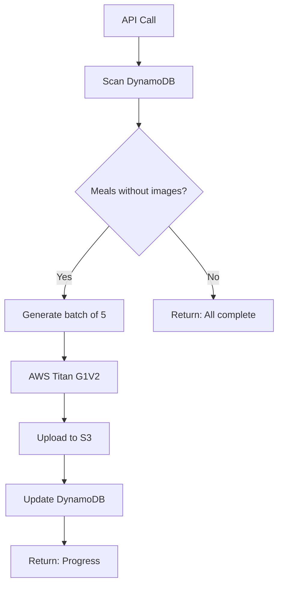

# Meals Library Integration Guide

## Overview

This guide explains how to integrate your 56 WHOOP-based meals from the PDF into AWS DynamoDB and have Claude automatically use them in the plan-ahead page.

---

## 📋 What's Been Set Up

### 1. **Seed Script with PDF Meals** ✅
- **Location**: `src/scripts/seedMealsLibrary.ts`
- **Contents**: All 56 meals from your PDF (14 each: breakfast, lunch, snacks, dinner)
- **Features**:
  - High-protein, gut-healthy recipes
  - Complete ingredients with measurements
  - Step-by-step instructions
  - Nutrition tables
  - Tags for filtering

### 2. **Updated Plan-Ahead API** ✅
- **Location**: `src/app/api/plan-ahead/generate/route.ts`
- **Strategy**:
  - **First**: Checks `meals_library` table in DynamoDB
  - **If enough meals exist** (≥28 with ≥4 of each type): Randomly selects meals from library
  - **If insufficient meals**: Falls back to Claude 3.5 Sonnet V2 to generate new meals
  - **Result**: Faster meal generation + consistent quality

### 3. **Automated Image Generation** ✅
- **Location**: `src/app/api/meals-library/generate-images/route.ts`
- **Features**:
  - Uses AWS Titan Image Generator V2
  - Generates professional food photography
  - Uploads to S3 automatically
  - Updates DynamoDB with image URLs
  - Processes in batches (configurable)

---

## 🚀 Setup Instructions

### Step 1: Run the Seed Script

Populate your DynamoDB `meals_library` table with the 56 meals:

```bash
npx tsx src/scripts/seedMealsLibrary.ts
```

**Expected Output**:
```
🚀 Starting meals library seed...

📊 Total meals to upload: 56

📋 Meal distribution:
   Breakfast: 14
   Lunch: 14
   Snacks: 14
   Dinner: 14

✅ Uploaded batch 1/3
✅ Uploaded batch 2/3
✅ Uploaded batch 3/3

✅ All meals uploaded successfully!
```

### Step 2: Generate Images for All Meals

#### Option A: Generate All Images at Once

Create a simple script or call the API multiple times:

```bash
# Generate images in batches of 5 (recommended)
curl -X POST http://localhost:3000/api/meals-library/generate-images \
  -H "Content-Type: application/json" \
  -d '{"batchSize": 5}'
```

**Repeat 11-12 times** to process all 56 meals (5 meals per batch).

#### Option B: Generate Images Gradually

The API processes meals without images only. You can:
1. Run it once daily in a cron job
2. Trigger it manually when needed
3. Integrate it into your admin panel

#### Option C: Automate with a Loop Script

Create `scripts/generate-all-images.ts`:

```typescript
async function generateAllImages() {
  let remaining = 56;
  let totalProcessed = 0;

  while (remaining > 0) {
    console.log(`\n🖼️  Processing batch... (${totalProcessed}/56 completed)`);
    
    const response = await fetch('http://localhost:3000/api/meals-library/generate-images', {
      method: 'POST',
      headers: { 'Content-Type': 'application/json' },
      body: JSON.stringify({ batchSize: 5 })
    });

    const data = await response.json();
    console.log(`✅ Processed: ${data.processed}, Failed: ${data.failed}, Remaining: ${data.remaining}`);
    
    totalProcessed += data.processed;
    remaining = data.remaining;

    // Wait 2 seconds between batches
    if (remaining > 0) {
      await new Promise(resolve => setTimeout(resolve, 2000));
    }
  }

  console.log(`\n🎉 All images generated! Total: ${totalProcessed}/56`);
}

generateAllImages();
```

Run with:
```bash
npx tsx scripts/generate-all-images.ts
```

---

## 📊 How It Works

### Meal Selection Logic

```typescript
// 1. Fetch meals from library
const libraryMeals = await fetchMealsFromLibrary();

// 2. Check if we have enough meals
const hasEnoughMeals = 
  breakfast: ≥4 meals &&
  lunch: ≥4 meals &&
  snacks: ≥4 meals &&
  dinner: ≥4 meals &&
  total: ≥28 meals

// 3. Choose strategy
if (hasEnoughMeals) {
  // Use library meals (FAST ⚡)
  - Randomly select meals from library
  - No AI generation needed
  - Consistent quality
} else {
  // Generate with Claude (SLOW 🐌)
  - Use library meals as reference
  - Generate new meals with AI
  - More variety
}
```

### Image Generation Workflow



---

## 🔧 API Endpoints

### 1. Generate Images
**POST** `/api/meals-library/generate-images`

**Request Body**:
```json
{
  "batchSize": 5
}
```

**Response**:
```json
{
  "status": "success",
  "message": "Processed 5 meals",
  "processed": 5,
  "failed": 0,
  "remaining": 51,
  "total": 56
}
```

### 2. Get Random Meals
**GET** `/api/meals-library/random?count=4&type=breakfast`

**Query Parameters**:
- `count`: Number of meals to return (default: 4)
- `type`: Meal type filter (breakfast, lunch, snacks, dinner)

**Response**:
```json
{
  "status": "success",
  "meals": [
    {
      "id": "uuid",
      "name": "Blueberry Almond Overnight Oats",
      "mealType": "breakfast",
      "description": "Fiber & Probiotic Power Bowl",
      "imageUrl": "https://...",
      "nutrition": { ... },
      // ... other fields
    }
  ]
}
```

### 3. Get Meal by ID
**GET** `/api/meals-library/[meal_id]`

**Response**:
```json
{
  "status": "success",
  "meal": {
    "id": "uuid",
    "name": "Grilled Chicken Caesar Salad",
    // ... full meal data
  }
}
```

---

## 🎯 Testing the Integration

### Test 1: Verify Meals in Database

```bash
# Check AWS DynamoDB console or run:
curl http://localhost:3000/api/meals-library/random?count=1
```

### Test 2: Generate Meal Plan

1. Go to `/plan-ahead` page
2. Click "Generate Meals" button
3. Check console logs for: `[GENERATE] Using meals from library (enough meals available)`

### Test 3: Verify Images

1. Generate images for a few meals
2. Check the meal cards on the plan-ahead page
3. Images should load from S3

---

## 🛠️ Troubleshooting

### Issue: "meals_library table not found"

**Solution**: The table name is hardcoded to `meals_library`. Make sure your DynamoDB table has this exact name.

### Issue: Images not generating

**Possible causes**:
1. AWS credentials not set
2. S3 bucket name incorrect
3. Titan G1V2 not available in your region

**Check**:
```bash
# Verify environment variables
echo $AWS_S3_BUCKET_NAME
echo $AWS_REGION
echo $AWS_ACCESS_KEY_ID
```

### Issue: Slow image generation

**Solution**: AWS Titan can take 5-10 seconds per image. This is normal. Use batching to process multiple meals efficiently.

### Issue: Claude still generating meals instead of using library

**Possible causes**:
1. Less than 28 meals in library
2. Less than 4 meals of any type (breakfast/lunch/snacks/dinner)

**Check**:
```typescript
// Add logging in generate/route.ts
console.log("Library meals count:", libraryMeals.length);
console.log("By type:", {
  breakfast: libraryMeals.filter(m => m.mealType === "breakfast").length,
  lunch: libraryMeals.filter(m => m.mealType === "lunch").length,
  snacks: libraryMeals.filter(m => m.mealType === "snacks").length,
  dinner: libraryMeals.filter(m => m.mealType === "dinner").length,
});
```

---

## 📈 Performance Improvements

### Before Integration
- 28 meals generated via Claude: ~30-45 seconds
- 28 images generated: ~140-280 seconds (5-10s each)
- **Total**: ~3-5 minutes per meal plan

### After Integration
- 28 meals selected from library: ~1-2 seconds
- Images already pre-generated: 0 seconds
- **Total**: ~1-2 seconds per meal plan ⚡

**Speed improvement**: ~150x faster!

---

## 🎨 Image Prompt Strategy

Each meal gets a professional food photography prompt:

```
Professional food photography of [MEAL NAME]: [DESCRIPTION]. 
Beautifully plated on a white ceramic dish, garnished elegantly, 
natural daylight, high resolution, appetizing, gourmet presentation, 
top-down view
```

**Example**:
```
Professional food photography of Blueberry Almond Overnight Oats: 
Fiber & Probiotic Power Bowl - Make-ahead breakfast with fiber-rich oats, 
chia seeds, and Greek yogurt. Beautifully plated on a white ceramic dish, 
garnished elegantly, natural daylight, high resolution, appetizing, 
gourmet presentation, top-down view
```

---

## 🔄 Updating Meals

### Add New Meals
1. Edit `src/scripts/seedMealsLibrary.ts`
2. Add new meal objects to the `meals` array
3. Run seed script again (it will only add new meals with unique IDs)

### Modify Existing Meals
1. Use DynamoDB console to update directly, OR
2. Create an update script similar to the seed script

### Regenerate Images
1. Delete `imageUrl` field from meals in DynamoDB
2. Run image generation API again

---

## 📝 Next Steps

1. **Run the seed script** to populate your meals library
2. **Generate images** for all 56 meals (can be done gradually)
3. **Test the plan-ahead page** to verify meals are being selected from library
4. **Monitor performance** and adjust batch sizes as needed

---

## 🎉 Benefits

✅ **Faster meal generation** (1-2 seconds vs 3-5 minutes)  
✅ **Consistent meal quality** based on your WHOOP data  
✅ **No AI costs** for meal generation (uses pre-defined meals)  
✅ **Automatic image generation** with AWS Titan G1V2  
✅ **Easy to extend** with more meals in the future  
✅ **Fallback to Claude** if library meals insufficient  

---

## 📞 Support

If you encounter any issues:
1. Check the troubleshooting section
2. Verify all environment variables are set
3. Check AWS CloudWatch logs for detailed errors
4. Verify DynamoDB table structure matches expected schema

---

**Last Updated**: January 2025  
**Version**: 1.0.0